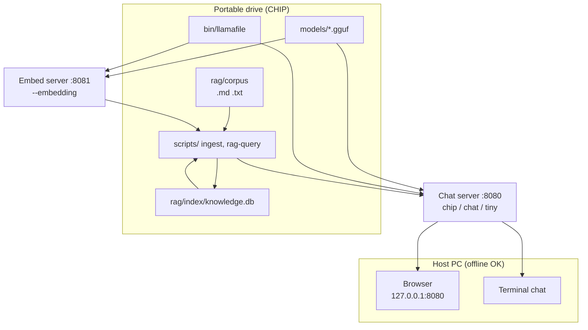

# CHIP

**C**risis **H**ost-**I**ndependent **P**reparedness

Portable **offline** AI for preparedness: chat, document tools, and semantic RAG over your own corpus — on a USB SSD, with **no cloud** and **no host install** after the one-time build.

Built by [MR Dula Enterprise, LLC](https://github.com/mrdulasolutions). Licensed under [Apache 2.0](LICENSE).

---

## What CHIP is

CHIP is a **kit** you copy onto an exFAT portable drive (e.g. Crucial X10 Pro). It ships scripts and docs in git; you add the **llamafile** runtime and **GGUF** models on the drive. Everything listens on **127.0.0.1** only.

| Piece | Role |
|-------|------|
| [llamafile](https://github.com/mozilla-ai/llamafile) | Single-binary inference (browser UI or terminal) |
| `rag/corpus/` | Your `.md` / `.txt` (and PDF-derived text) |
| `rag/index/knowledge.db` | Offline vector index for semantic Q&A |
| Launch scripts | Double-click or one command on a new PC |

**Who it is for:** preppers, homesteaders, and teams who want **grid-down** access to manuals, playbooks, and notes — with an assistant that runs entirely on the laptop you have, not a datacenter.

**Who it is not for:** phones, ChromeOS, locked corporate PCs, or anyone expecting medical/legal/financial advice from a local model (see [Disclaimer](#disclaimer)).

---

## Architecture



**RAG path:** chunk corpus → embed via llamafile → SQLite index → retrieve top-k → optional chat with context. Details: [docs/RAG.md](docs/RAG.md).

---

## Prerequisites

| Requirement | Notes |
|-------------|--------|
| **64-bit** Windows 10+, macOS, or Linux | Not 32-bit, not iOS/Android |
| **USB 3** SSD, **exFAT**, volume label `CHIP` recommended | Avoid BitLocker/FileVault on the stick |
| **RAM** | ≥ file size of the model you run; see [model matrix](#model-matrix) |
| **One online session** | Download runtime, models, corpus, build index at home |
| **python3** | Only for RAG ingest/query (stdlib + scripts in repo) |

---

## One-shot paths

### Humans

From a clone or release folder:

```bash
chmod +x build-chip.sh
./build-chip.sh /Volumes/CHIP --full
```

Then on any computer: double-click **`Launch CHIP.command`** (Mac), **`Launch CHIP.bat`** (Windows), or **`./Launch CHIP.sh`** (Linux). See [docs/AUTOSTART.md](docs/AUTOSTART.md).

### Coding agents

Follow **[AGENTS.md](AGENTS.md)** — clone, `build-chip.sh`, optional `--full`, ingest, `rag-query` smoke test. No secrets in the repo.

---

## Model matrix

| Profile | File | Typical RAM | Use case |
|---------|------|-------------|----------|
| **tiny** | `models/tiny.gguf` | ~8 GB | Smallest instruct (~1–4B Q4) |
| **chip** | `models/chip.gguf` | ~8 GB | **Default** — Hermes 3 Llama 3.2 **3B** Q4 (~1.9 GB), `./download-chip-model.sh` |
| **chat** | `models/chat.gguf` | 16 GB+ | Daily 7–8B instruct Q4 (~5 GB) |
| **embed** | `models/embed.gguf` | +embed server | RAG only — bge-small-en-v1.5 Q4 (~30 MB), `./download-embed-model.sh` |

Full notes: [models/README.md](models/README.md).

```bash
./start.sh chip          # macOS/Linux — browser http://127.0.0.1:8080
./start.sh chat tui      # terminal chat, larger model
start.bat chip           # Windows
```

---

## Corpus and RAG workflow

1. **While online:** `./scripts/fetch-corpus.sh` (prepper sources — [docs/CORPUS-SOURCES.md](docs/CORPUS-SOURCES.md)).
2. **PDFs:** `./download-pdf-tools.sh` then `./scripts/pdf-to-text.sh`.
3. **Add your files** under `rag/corpus/`.
4. **Build index:** `./start-embed.sh` → `./scripts/ingest-corpus.sh` → `rag/index/knowledge.db`.
5. **Grid-down:** `./start-rag.sh` or launchers; query with `./scripts/rag-query.sh "purify water" [--chat]`.

Large fetched corpora stay on the drive and are **gitignored**; only scripts and small samples live in GitHub.

---

## Grid-down quick start (new computer)

| Step | macOS | Windows | Linux |
|------|--------|---------|--------|
| Mount drive | `/Volumes/CHIP` | `D:\CHIP` (letter varies) | `/media/$USER/CHIP` |
| Launch | `Launch CHIP.command` | `Launch CHIP.bat` | `./Launch\ CHIP.sh` |
| Browser | http://127.0.0.1:8080 | same | same |
| RAG CLI | `./scripts/rag-query.sh "question"` | Git Bash or WSL | `./scripts/rag-query.sh` |

If the binary is blocked: macOS → remove quarantine (`xattr -d com.apple.quarantine bin/llamafile`); Windows → “Run anyway” on SmartScreen. Linux `noexec` USB: remount with `exec` or run from `/tmp`. See troubleshooting below.

---

## Repository layout

```
CHIP/
  build-chip.sh          # one-shot install to USB
  AGENTS.md              # agent playbook
  Launch CHIP.*          # double-click launchers
  bin/                   # llamafile + pdf tools (not in git)
  models/                # *.gguf on drive only
  rag/corpus/            # documents
  rag/index/             # knowledge.db (built locally)
  scripts/               # fetch, ingest, rag-query, pdf-to-text
  docs/                  # RAG, corpus, autostart, capabilities
  start.sh / start.bat
```

---

## Troubleshooting

| Issue | Fix |
|-------|-----|
| macOS blocks `llamafile` | System Settings → Privacy & Security → Open Anyway, or `xattr -d com.apple.quarantine bin/llamafile` |
| Windows SmartScreen | Choose “Run anyway” for `llamafile.exe` |
| Linux USB `noexec` | Remount with `exec`, or copy binary to `/tmp` |
| Slow model load | USB 3 port; confirm SSD + exFAT |
| RAG empty / errors | Re-run ingest; ensure `start-embed.sh` on :8081 |
| `start-rag.sh` exits instantly / browser won’t load | `./start-rag.sh stop` then `./start-rag.sh` again (waits up to ~3 min). Check `tmp/chat.log` if ports **8080/8081** are busy; quit other llamafile copies or use `EMBED_PORT=8082 PORT=8083` |
| Browser: **“Stream resume produced no new bytes”** | Usually chat ran out of RAM mid-stream (embed on :8081 + **chat.gguf** 8B with huge default context). `./start-rag.sh stop` then `./start-rag.sh` (defaults to **chip** 3B, `CHIP_CTX_SIZE=8192`, `CHIP_PARALLEL=1`). For 8B chat with RAG: `RAG_CHAT_MODEL=chat CHIP_CTX_SIZE=8192 ./start-rag.sh` on **16 GB+** only. Check `memory_pressure` / Activity Monitor; quit Ollama or other LLM apps. |
| `./start.sh` alone loads **chat** not **chip** | If `models/chat.gguf` exists it wins over chip — use `./start.sh chip` or remove/rename `chat.gguf` on tight RAM |
| Missing model | Run `./download-chip-model.sh` (or add `tiny.gguf` / `chat.gguf` manually) |

GPU: set `LLAMA_NGL=999` (NVIDIA) or `LLAMA_NGL=0` for CPU-only. Apple Silicon uses Metal when available.

---

## Disclaimer

CHIP and its corpus are for **informational and educational** use. Output from local models is **not** medical, legal, financial, or professional advice. You are responsible for compliance with law, safety, and sound judgment — especially for health, weapons, foraging, and emergency actions. Verify critical steps with qualified professionals and primary sources.

---

## Contributing

See [.github/CONTRIBUTING.md](.github/CONTRIBUTING.md). Issues and PRs welcome at [github.com/mrdulasolutions/CHIP](https://github.com/mrdulasolutions/CHIP).

---

## Links

- **Repository:** https://github.com/mrdulasolutions/CHIP  
- **MR Dula Enterprise:** https://github.com/mrdulasolutions  
- **Engine:** https://github.com/mozilla-ai/llamafile  
